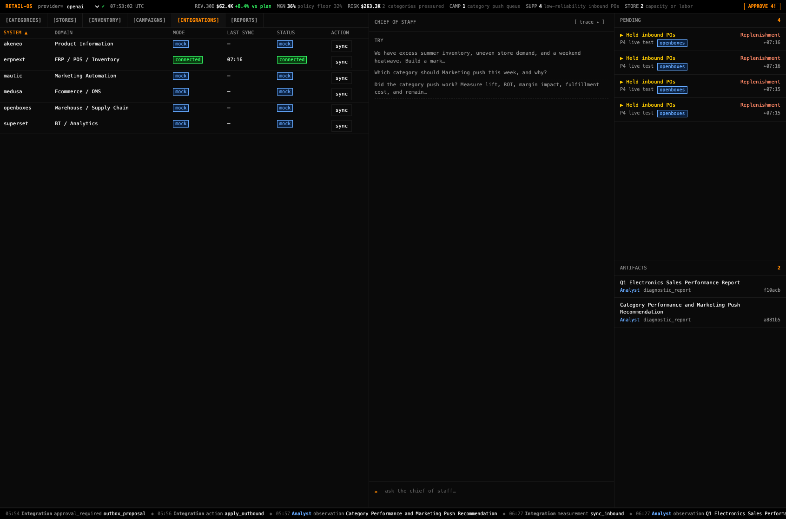
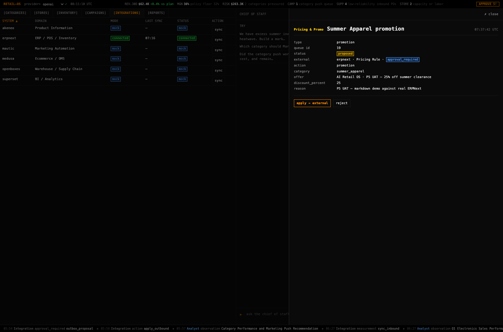
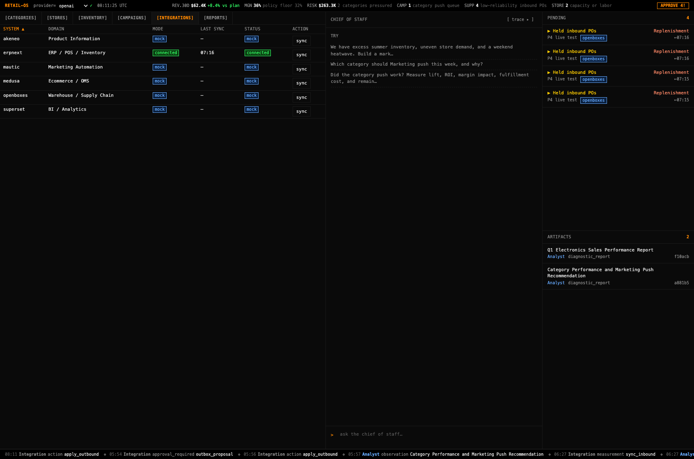
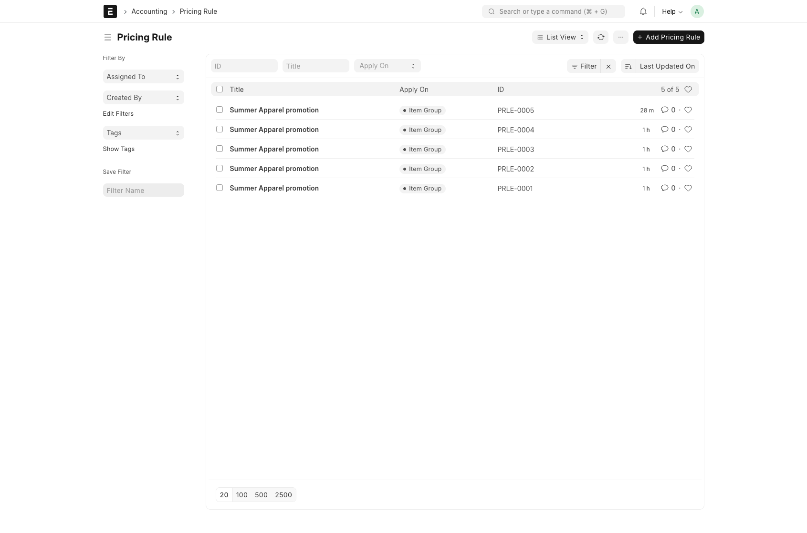
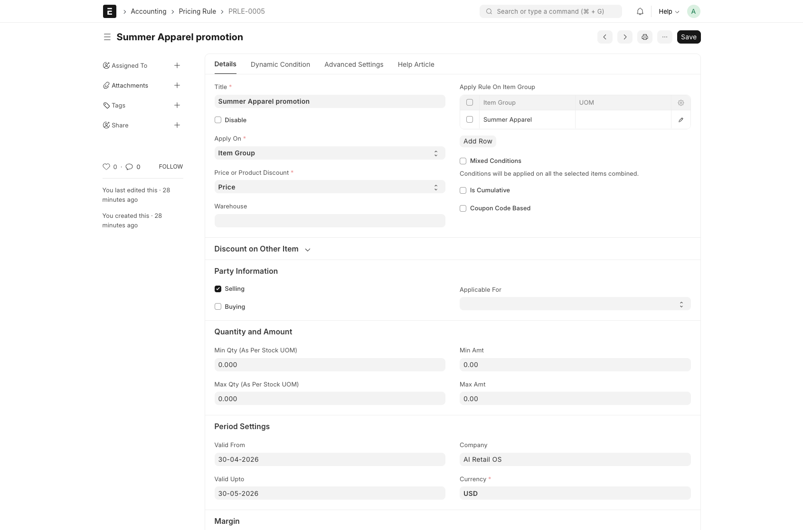

# ERPNext P5 — Markdown demo UAT log

**Date:** 2026-04-30
**Scope:** End-to-end run of the README markdown demo against a real ERPNext instance: operator approves a markdown → live `Pricing Rule` lands in ERPNext.

## Setup

Before the demo: the local stack is up and seeded.

```bash
make erpnext-up
make erpnext-bootstrap
make erpnext-seed
```

`backend/.env` carries the API credentials:

```env
ERPNEXT_BASE_URL=http://localhost:8080
ERPNEXT_API_KEY=...
ERPNEXT_API_SECRET=...
ERPNEXT_COMPANY=AI Retail OS
```

Backend on `:8000`, frontend on `:5173`, ERPNext on `:8080`. ERPNext adapter reports `mode=connected` in the cockpit's Integrations tab.

Pre-UAT count of `Pricing Rule` docs in ERPNext:

```
GET /api/resource/Pricing Rule  →  data: 4 rows  (PRLE-0001…PRLE-0004 from prior runs)
```

## Step 1 — Pricing & Promo proposes a markdown

A direct call into the substrate stand-in for the chat path:

```python
from app.substrate import omnichannel
omnichannel.create_promotion(
    category="summer_apparel",
    offer="AI Retail OS · P5 UAT — 25% off summer clearance",
    discount_percent=25,
    reason="P5 UAT — markdown demo against real ERPNext",
)
```

Returns:

```json
{
  "action_id": 19,
  "erpnext_outbox_id": 20,
  "outbox_status": "approval_required"
}
```

The cockpit picks it up immediately:



Notes:
- Status strip: `APPROVE 5!` chip pulses amber. erpnext row in the Integrations tab is `connected` · last sync 07:16.
- Pending rail row 1: `▶ Summer Apparel promotion` — Pricing & Promo (pink) · external system `erpnext` · timestamp `←07:37`.
- Rows 2–5 are stale `Held inbound POs` rows from earlier P4 test runs whose `openboxes` outbox is still in `mock_only` (openboxes adapter isn't configured) — they hang around because the rail rightly considers any `mock_only` external still pending.

## Step 2 — Operator opens the drawer

Click the `▶ Summer Apparel promotion` row.



The drawer renders the action's full payload as a definition list and surfaces the external target:

| Field | Value |
|---|---|
| type | `promotion` |
| queue id | `19` |
| status | `proposed` (warn chip) |
| external | `erpnext · Pricing Rule · approval_required` (info chip) |
| action | `promotion` |
| category | `summer_apparel` |
| offer | `AI Retail OS · P5 UAT — 25% off summer clearance` |
| discount_percent | `25` |
| reason | `P5 UAT — markdown demo against real ERPNext` |

Footer: amber `apply → external` and dim `reject` buttons.

## Step 3 — Operator clicks `apply → external`

Backend dispatches via `ERPNextAdapter.apply_outbound` → `_erp_create_pricing_rule` → `POST /api/resource/Pricing Rule`. ERPNext returns `name=PRLE-0005`.

The drawer flashes `applied — Pricing Rule PRLE-0005 draft created — 25% off Summer Apparel.` for 2s, then auto-closes.



Tape (bottom strip) now leads with:

```
08:11 Integration action apply_outbound
```

## Step 4 — Verify the doc landed in ERPNext

ERPNext desk (`Administrator` / `retail-admin`):

`/app/pricing-rule` list — count is now **5 of 5**, with `PRLE-0005 · Summer Apparel promotion` at the top:



`/app/pricing-rule/PRLE-0005` detail — every field we sent is there:



| Field | Value |
|---|---|
| Title | Summer Apparel promotion |
| Apply On | Item Group |
| Item Group | Summer Apparel |
| Price or Product Discount | Price |
| Discount Percentage | 25 |
| Selling | ✓ |
| Buying | ✗ |
| Valid From | 30-04-2026 |
| Valid Upto | 30-05-2026 |
| Company | AI Retail OS |
| Currency | USD |

## Result

End-to-end agent loop runs against a real ERPNext:

- Specialist proposes → outbox row in `approval_required`.
- Cockpit drawer surfaces the payload and the external target.
- Operator approves → `ERPNextAdapter.apply_outbound` posts a real Pricing Rule draft.
- `Pricing Rule` count goes from 4 → 5.
- The new doc carries the operator's discount and a 30-day validity window.

## Bug fixed during this UAT

Before the rail-filter change in this commit, **promotions were invisible in the Pending rail** when the adapter was configured: `external_actions[…].status` came back as `approval_required`, and the rail only matched `mock_only`/`proposed`. Status-strip `APPROVE n!` chip undercounted the same way.

Both filters now share `PENDING_EXTERNAL_STATUSES = {approval_required, mock_only, proposed}` so a configured-adapter promotion shows up as a pending row immediately. The status-strip count and rail count are kept in lockstep by re-using the same set across `ApprovalRail.tsx` and `StatusStrip.tsx`.
